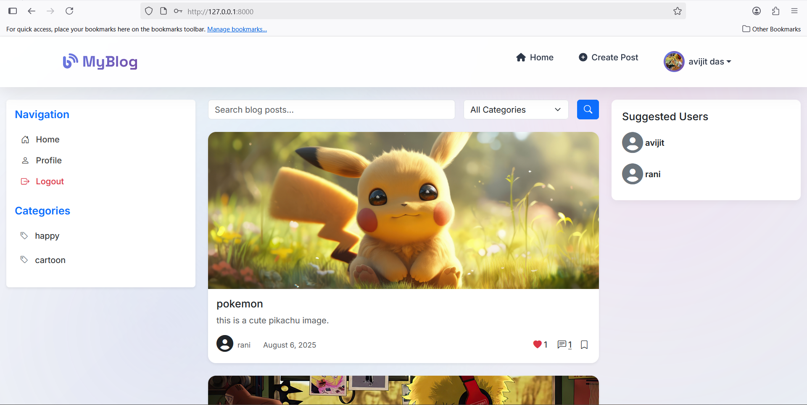
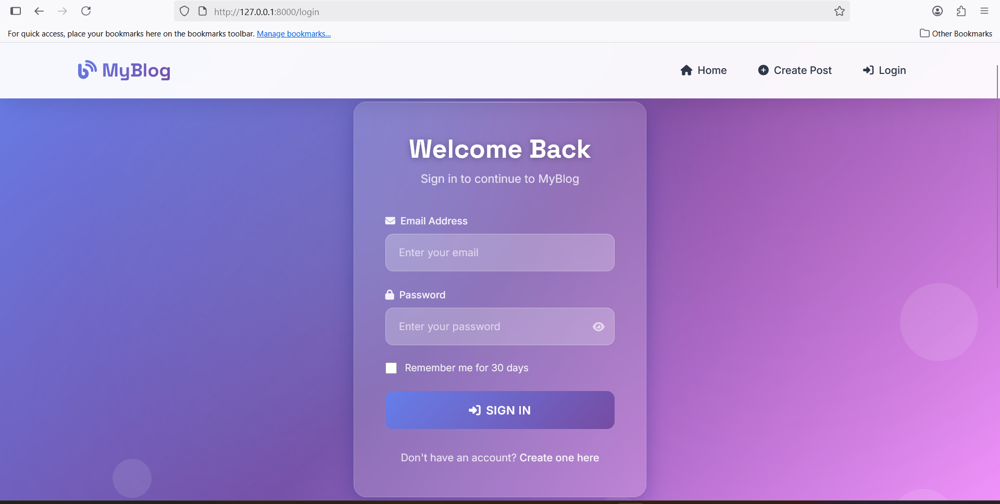
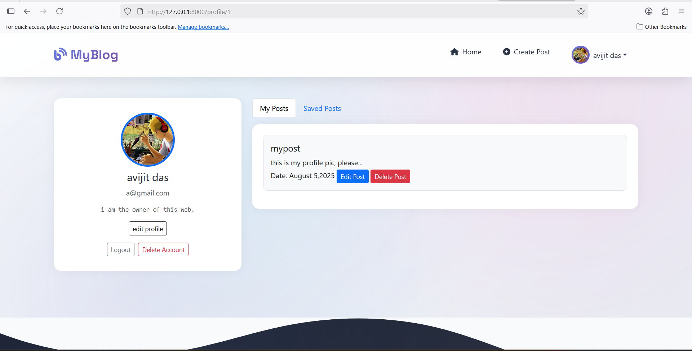
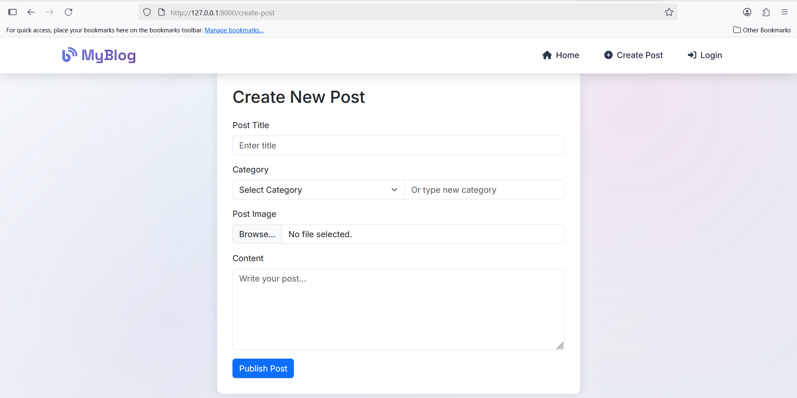

# 📝 Blog Website

  
  
  


A modern **Blog Website** built with **Laravel, PHP, MySQL, and Bootstrap**.  
Users can create posts, interact via likes & comments, and manage their profiles with a responsive UI.

---

## ✨ Features

✅ User Authentication (Register/Login)  
✅ Create, Edit & Delete Blog Posts  
✅ Like ❤️ & Comment 💬 on Posts  
✅ Save 🔖 Posts for Later  
✅ User Profiles 👤 with Editable Info  
✅ Responsive UI 📱 using Bootstrap

---

## 📂 Project Structure

blog-website/
│-- app/ # Laravel Application Code
│-- bootstrap/ # Framework bootstrap files
│-- config/ # Configuration files
│-- database/ # Migrations & Seeders
│-- public/ # Public assets (CSS, JS, Images)
│-- resources/ # Views & Frontend assets
│-- routes/ # Web & API Routes
│-- storage/ # Cached files, logs, uploads
│-- tests/ # PHPUnit tests
│-- .env.example # Example environment file
│-- composer.json # Composer dependencies
│-- package.json # NPM dependencies
│-- vite.config.js # Vite build configuration

---

## ⚙️ Installation

Clone the repository and install dependencies:

```bash
git clone https://github.com/dascode0/blog-website.git
cd blog-website
```

## 📸 Screenshots

### 🏠 Home Page



### 🔑 Login Page



### 👤 User Profile



### 👤 post share


